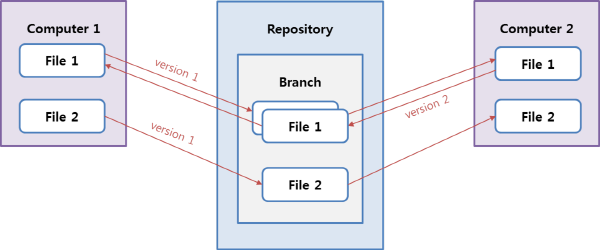
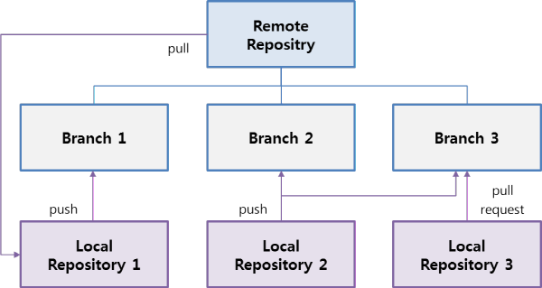
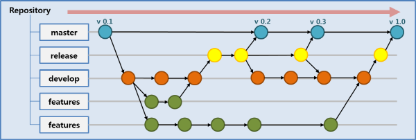

---?image=images/ssafy_main.png

### Git과 markdown을 잘 활용해보자!
###### Let's take an advantage of Git and Markdown

---?image=images/ssafy_bg.png
* 목표
  - 마크다운 형식의 문서를 이해한다.
  - Git Pitch를 활용하여 마크다운 문서를 프레젠테이션으로 활용한다.
  - GitHub 블로그를 생성하고 포스팅하는 방법을 익힌다.

+++?image=images/ssafy_bg.png
## Today's Mission 
###### 팀별 블로그를 만들고 다음과 같이 활용해 봅시다.
###### 팀소개 프레젠테이션 만들기
1. PITCHME.md 문서를 만들고 아래 내용을 포함하여 작성합니다.
  - 팀원들의 이름과 별명, 성격
  - 팀원 또는 팀원들의 특징을 잘 나타낼 수 있는 사진 
  - 연말 계획 및 12월 31일에 하고 싶은 것

2. Git Pitch로 해당 문서를 열어 슬라이드가 잘 만들어졌는지 확인합니다. 

###### 스타트캠프의 주요 주제들을 블로그에 포스팅해 봅시다.
1. 팀소개 프레젠테이션 링크
2. 주제1
3. 주제2
4. 주제3

---?image=images/ssafy_bg.png
Git이란 무엇일까요?
Git은 리눅스의 창시자로 알려진 리누스 토발즈에 의해 고안된 버전 관리 시스템(VCS)입니다. 온라인 작업 공간과 변경이력 관리 기능 등을 제공하며, 협업에 편리하도록 설계되어 있습니다.

---?image=images/ssafy_bg.png
Git은 다음과 같은 목적을 지향하며, DevOps 환경에 상당한 편의성을 제공하고 있습니다. 
- 빠른 속도 
- 간단한 구조 
- 비선형적 개발 
- 완전 분리 
- 대규모 프로젝트의 효율화

---?image=images/ssafy_bg.png
VCS의 장점 중 대표적인 것은 아래와 같으며, 개발/운영의 요구사항을 쉽게 반영하고 관리할 수 있습니다. 
- 개별 파일들에 대한 버전 관리가 가능하다는 점 
- 분할/병합을 통해 병렬 작업이 가능하다는 점

---?image=images/ssafy_bg.png
그럼, 아래 항목들을 순서대로 진행하며 오늘의 미션을 완수해 볼까요?

1. GitHub 가입하기: [click](https://ssafy2018.github.io/public/Join-GitHub/)
2. 블로그 만들기: [click](https://ssafy2018.github.io/public/Add-Collaborator/) 
3. 공동 작업 환경 만들기: [click](https://ssafy2018.github.io/public/Slideshow-with-GitPitch/)
4. Git Pitch 슬라이드 기능 활용하기: [click](https://ssafy2018.github.io/public/Create-Page-with-Theme/) 
5. 블로그에 포스팅하기: [click](https://ssafy2018.github.io/public/Posting-on-Your-Blog/)
