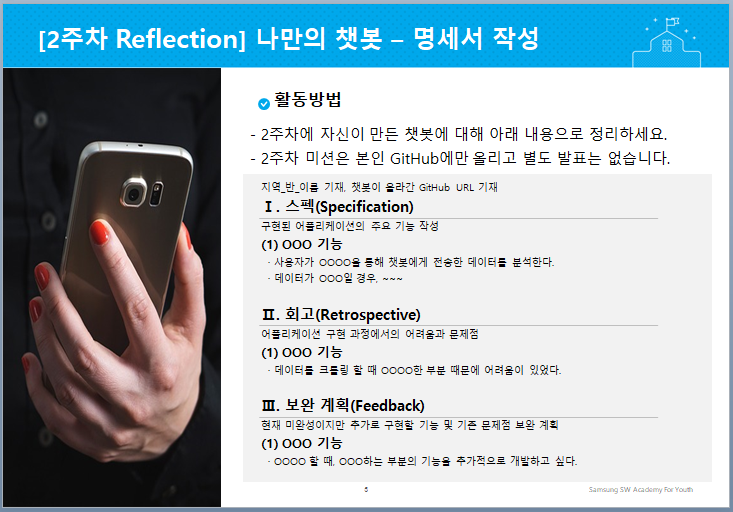

예시)

# SSAFY Start Camp 챗봇 퀘스트

지역_1_김싸피, https://github.com/ㅇㅇㅇ

## I. 스펙(Specification)

구현된 어플리케이션의 주요 기능
#### (1) ㅇㅇㅇ 기능
  - 사용자가 ㅇㅇㅇㅇ을 통해 챗봇에게 전송한 데이터를 분석한다.
  - 데이터가 ㅇㅇㅇ일 경우, ~~~

## II. 회고(Retrospective)

어플리케이션 구현 과정에서의 어려움과 문제점
  - 데이터를 크롤링 할 때 ㅇㅇㅇㅇ한 부분 때문에 어려움이 있었다.

### III. 보완 계획(Feedback)

현재 미완성이지만 추가로 구현할 기능 및 기존 문제점 보완 계획
#### (1) ㅇㅇㅇ 기능
  - ㅇㅇㅇㅇ 할 때, ㅇㅇㅇ하는 부분의 기능을 추가적으로 개발하고 싶다.
