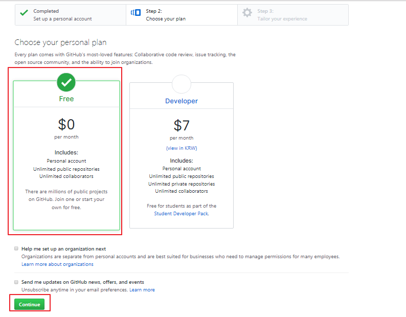
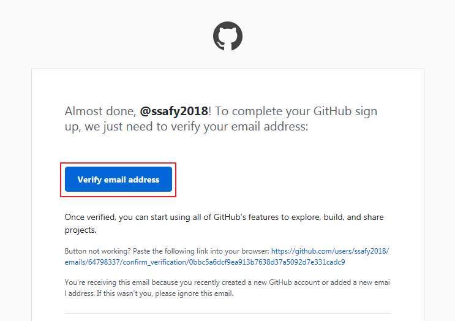

GitHub는 GitLab, BitBucket과 함께 Git을 제공하는 대표적인 서비스입니다.
그 중에서도 인지도가 높고 가장 많은 사용자를 보유하고 있어, 개발에 활용하고 협업하기에 매우 유용합니다.

* 웹브라우저를 열어 아래 주소로 접속합니다.
   - https://github.com

* 가입 항목을 작성하고 [Sign up for GitHub]을 클릭합니다.

   {: width="600px"}

* 1단계 확인을 거친 후 2단계 Free Plan을 선택합니다.

   {: width="600px"}

* 3단계는 꼭 거치지 않아도 문제 없으므로 [skip this step]을 클릭합니다.

   {: width="600px"}

* 가입 시 작성한 메일 주소로 발송한 인증 메일을 확인합니다.

  {: width="600px"}
  

*이제 GitHub를 사용할 준비가 되었습니다!*
