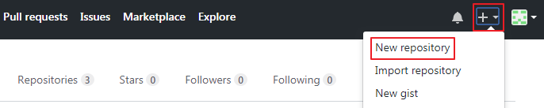
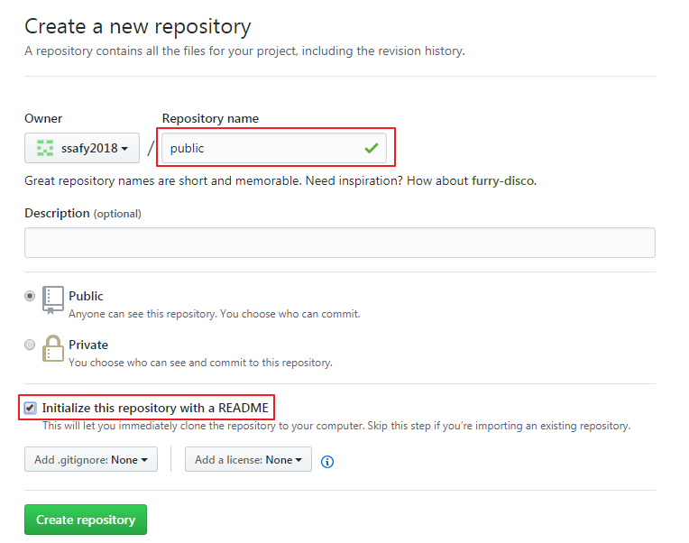
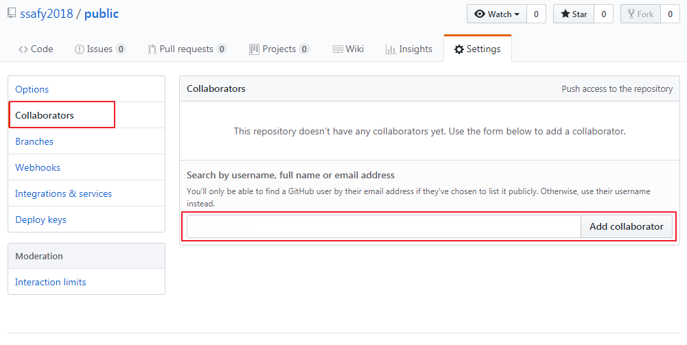
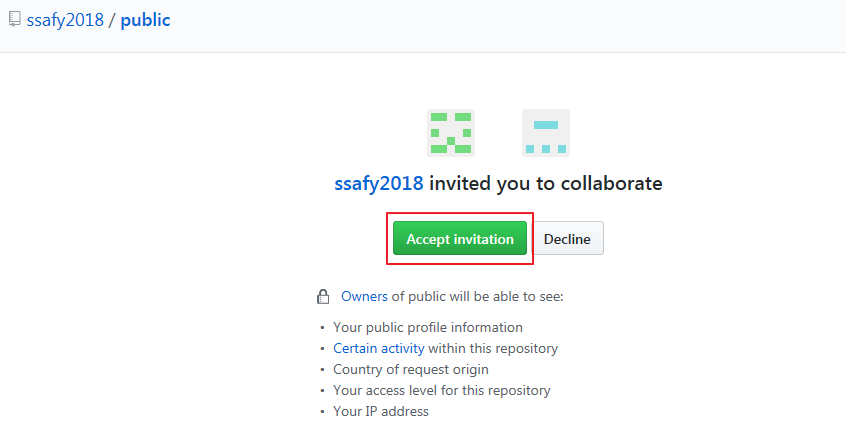

GitHub에 작업을 관리할 수 있는 저장소를 만들 수 있으며 이를 Repository라고 부릅니다.
Repository는 다른 사람과 공동으로 작업할 수 있도록 설정 가능합니다.

* [New repository]를 클릭합니다.

  {: width="600px"}

* Repository명을 입력하고 README.md 부분의 체크박스를 체크합니다.

  {: width="600px"}

* Settings에서 Collaborators를 선택합니다.
* 함께 작업하기 원하는 GitHub 사용자명을 입력하고 [Add collaborator]를 클릭합니다.

  {: width="600px"}

* 상대방에게 요청 메일이 발송되고, 승인 대기 상태가 됩니다.

  {: width="600px"}

* 해당 사용자는 Repository 요청 메일을 열어 링크를 클릭합니다.

  {: width="600px"}
  
  
* GitHub에 로그인하여 요청을 수락하면, 해당 Repository에 작업 권한을 얻게 됩니다.
  
  {: width="600px"}
  

* Repository 생성자는 동일한 방법으로 팀원을 모두 공동 작업자로 추가하도록 합시다.
* 해당 Repository의 주소를 반장에게 제출합니다.

*이제 하나의 Repository를 공동으로 작업할 수 있게 되었습니다!*

