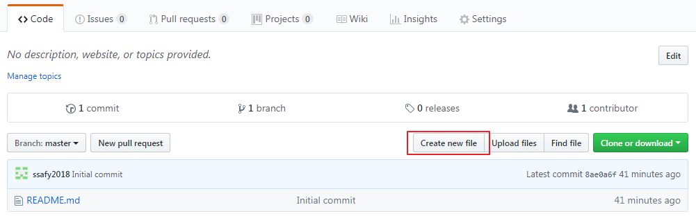
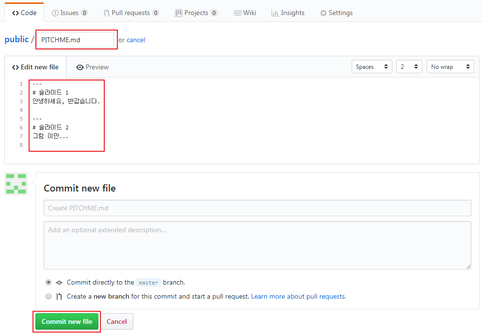
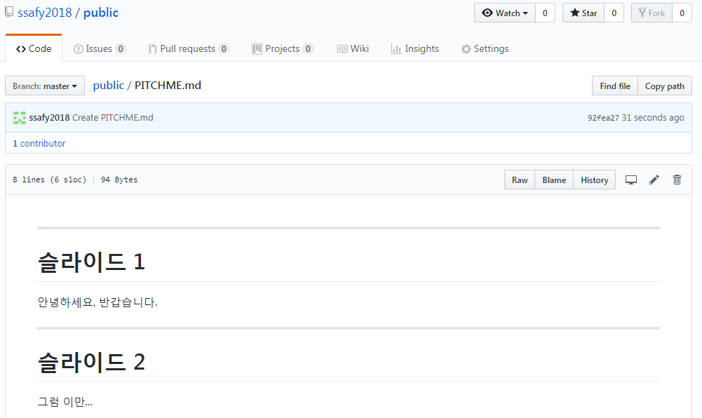

GitHub에서는 HTML, Markdown 형식 등의 문서를 지원합니다.
GitPitch는 이렇게 작성된 Markdown 문서를 슬라이드로 렌더링해주는 프레젠테이션 도구로써, 별도의 절차없이 Git에 저장딘 문서를 불러와 슬라이드쇼로 볼 수 있습니다.

* [Create new file]을 클릭합니다.

  {: width="600px"}


* 파일명을 PITCHME.md로 정하고 아래 예시를 입력한 후 [Commit new file]을 클릭합니다.

  ```
  ---
  # 슬라이드 1
  안녕하세요, 반갑습니다.

  ---
  # 슬라이드 2
  그럼 이만...
  ```

  {: width="600px"}


* Repository에서 PICHME.md 파일을 클릭하면 생성된 마크다운 문서를 볼 수 있습니다.

  {: width="600px"}


* 이제 웹 브라우저 주소창에 아래와 같이 입력해 볼까요?
  - https://gitpitch.com/*사용자명*/*Repository명*/*Branch명*
    (Branch명이 master이면 생략 가능)
  - 예: https://gitpitch.com/ssafy2018/public

{: width="600px"}

{: width="600px"}


* 똑같은 파일이지만 GitHub에서 본 것과는 다르게 슬라이드쇼로 나타나는 것을 볼 수 있습니다.
* GitHub에서처럼 기본적인 마크다운 양식을 사용할 수 있습니다.
* GitPitch에서 제공하는 스타일과 테마를 적용하면 더욱 멋진 슬라이드를 만들 수도 있습니다.
  - https://gitpitch.com/docs
